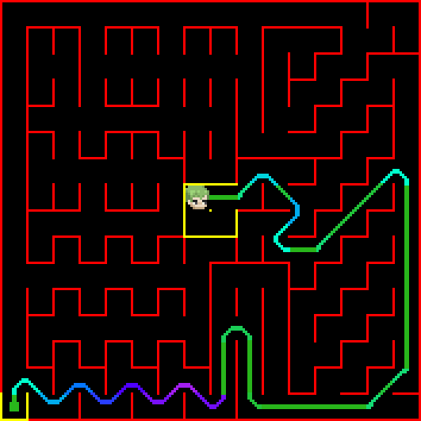
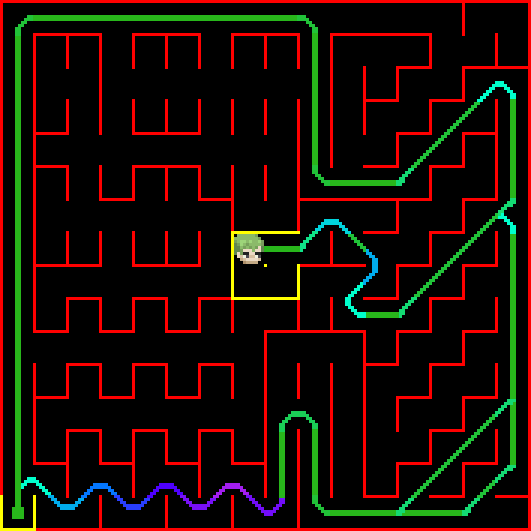
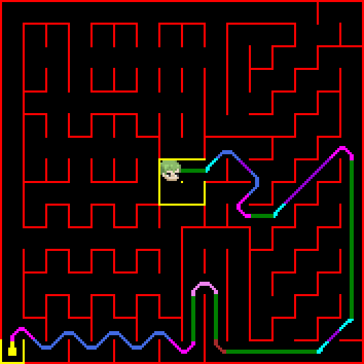
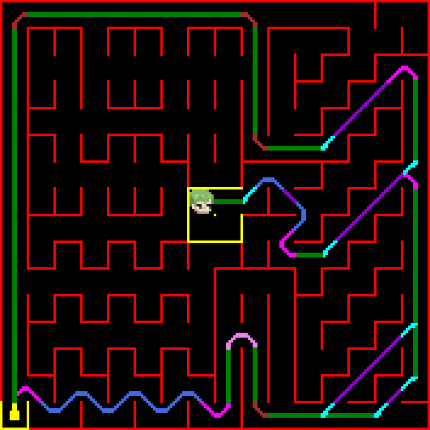
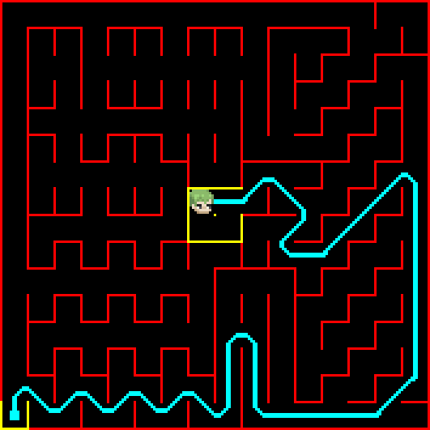
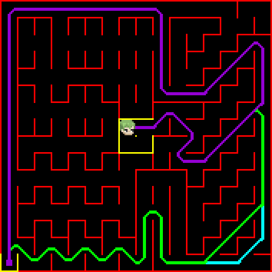
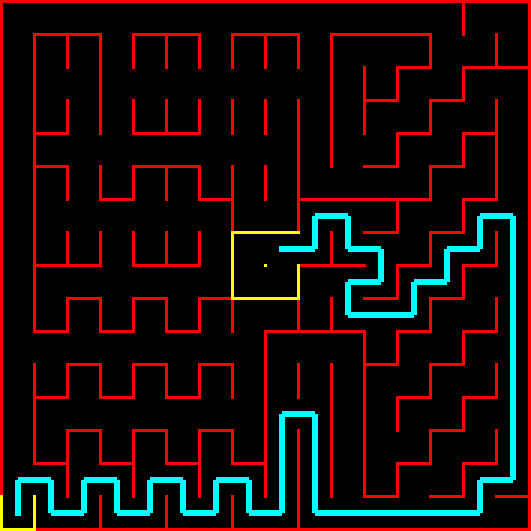
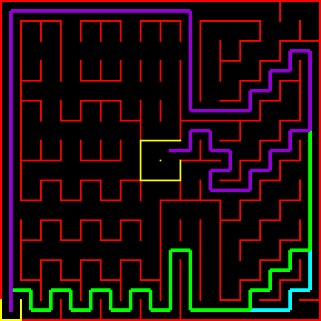

# ZoroBot3: Paths Visualizer

Este proyecto permite visualizar lo que hara nuestro robot ZoroBot3 en cualquier laberinto utilizando sus algoritmos de resolucion, con sprites personalizados y rutas coloreadas. Permite generar imágenes de las ejecuciones del simulador, tanto en Google Colab como en terminal (Windows/Linux).

## Características

- **Visualización con sprites:** Cada acción de ZoroBot (avance, giros, diagonales, zigzags..) se representa con un sprite único.
- **Rutas coloreadas:** Los segmentos y curvas se colorean según su tipo, con modos agrupado, único o por partes.
- **Parsing robusto:** Las acciones se extraen directamente del output del simulador de zoro.
- **Multiplataforma:** Funciona en Colab y terminal, windows o linux.
- **Interfaz por argumentos:** Permite uso flexible desde terminal.

## Uso

### Desde Google Colab

1. Sube tu archivo de laberinto y el ejecutable del simulador.
2. copia el codigo de este script en una celda del colab.
3. Ejecuta el script y llama en otra celda a la función `main()` con los parámetros deseados:

```python
main(
    map_path="Portuguese Micromouse Contest 2025.map",
    sim_path="../maze_sim",
    output_path="maze_paths.bmp",
    floodfill_types=[0, 1, 2, 3],   # Tipos de floodfill
    explore_types=[0, 1, 2],        # Tipo de exploración
    render_mode="sprites",          # "sprites" o "lines"
    color_mode="parts"              # "parts", "single" o "danger"
)

# Mostrar la imagen generada
from PIL import Image
from IPython.display import display
img = Image.open("maze_paths.bmp")
display(img)
img_grande = img.resize((img.width*3, img.height*3), Image.NEAREST)
display(img_grande)
```

### Desde Terminal (Windows/Linux)

Ejecuta el script con argumentos:

```
python paths_visualizer.py --map "../simulator/mazes/maze.map" --sim "../simulator/maze_sim" --output "maze_paths.bmp" --floodfill 3 --explore 2 --render sprites --color parts
```

- `--map`: Ruta al archivo de mapa
- `--sim`: Ruta al ejecutable del simulador
- `--output`: Nombre del archivo de imagen de salida
- `--floodfill`: Tipos de floodfill (0 1 2 3)
- `--explore`: Tipo de exploración (0 1 2)
- `--render`: Modo de renderizado (`sprites` o `lines`)
- `--color`: Modo de color (`parts`, `single`, `danger`). Si hay más de un floodfill, se colorea automáticamente cada ruta distinta.

## Ejemplo de Variaciones de Comando

### 1. Sprites Danger (movimientos coloreados según peligrosidad del recorrido)

| Un camino                                                                   | Varios caminos                                                                  |
| --------------------------------------------------------------------------- | ------------------------------------------------------------------------------- |
|  |  |

### 2. Sprites Parts (subpartes marcadas con un color distinto por cada movimiento)

| Un camino                                                                 | Varios caminos                                                                |
| ------------------------------------------------------------------------- | ----------------------------------------------------------------------------- |
|  |  |

### 3. Sprites Single (movimientos reales de Zoro, un color por recorrido)

| Un camino                                                                   | Varios caminos                                                                  |
| --------------------------------------------------------------------------- | ------------------------------------------------------------------------------- |
|  |  |

### 4. Lines (recorridos marcados solo con giros de 90º, un color por recorrido)

| Un camino                                                 | Varios caminos                                                |
| --------------------------------------------------------- | ------------------------------------------------------------- |
|  |  |

## Utilidades de Imagen (`/utils/img_utils.py`)

- **bmp_to_sprite_array:** Convierte archivos .bmp monocromáticos a arrays hexadecimales de sprites con preview ASCII.
- **bmp_to_color_matrix:** Convierte archivos .bmp a matrices RGB para sprites a color.
- **color_matrix_to_image:** Muestra matrices RGB como imágenes (útil para previsualizar sprites).

**Nota:**

- Coloca los archivos .bmp de sprites en la carpeta `utils/sprites/` para usar la conversión automática.
- Los .bmp deben ser de 12x12 o 23x12 píxeles monocromaticos para funcionar en el conversor.

## Requisitos

- Python 3
- Librerías:
  - Pillow
  - matplotlib
